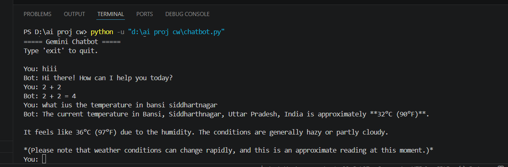

# 🤖 Gemini Chatbot using Python

A simple command-line chatbot built using **Python** and the **Google Gemini API**. It accepts user input, sends it to the Gemini model, and displays the generated response.

---

## 📌 Features

- 💬 Answers user queries using Gemini API
- 🐍 Built with Python
- 🔐 Uses `.env` file to securely store the API key
- 🖥️ Simple command-line interface
- 🚀 Beginner-friendly project

---

## 🛠️ Technologies Used

- Python
- Google Gemini API
- google-generativeai
- python-dotenv

---

## 📂 Project Structure

```text
AI_LaunchPad_Pratice/
│── chatbot.py
│── .env
│── .gitignore
│── README.md
│── images/
│   └── chatbot.png
```

---

## ⚙️ Installation

### 1. Clone the repository

```bash
git clone https://github.com/ansh10tripathi/AI_LaunchPad_Pratice.git
```

### 2. Navigate to the project folder

```bash
cd AI_LaunchPad_Pratice
```

### 3. Install dependencies

```bash
pip install google-generativeai python-dotenv
```

### 4. Create a `.env` file

```env
GEMINI_API_KEY=YOUR_GEMINI_API_KEY
```

### 5. Run the chatbot

```bash
python chatbot.py
```

---

## 📸 Output Screenshot



---

## ▶️ Example

```text
===== Gemini Chatbot =====
Type 'exit' to quit.

You: Hello

Bot: Hello! How can I help you today?

You: What is Artificial Intelligence?

Bot: Artificial Intelligence (AI) is the simulation of human intelligence by machines...
```

---

## 👨‍💻 Author

**Ansh Tripathi**

B.Tech CSE (AI & ML)

Lovely Professional University

---

## ⭐ Note

This project was developed as a beginner-level implementation to understand how to integrate the Google Gemini API with Python and build a simple conversational chatbot.